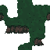

# pixijs-easygrid

A "good enough" grid sprite for PixiJS. This library supports basic grid rendering and also dual-grid.

## Demos

Have a look at these [online demos](https://parogers.github.io/pixijs-easygrid-examples/index.html), and take a peek at the [source code](https://github.com/parogers/pixijs-easygrid/tree/main/examples).

## API

### Concepts

* Grid - A rectangular collection of cells that renders as a PIXI sprite. The underlying code makes use of PIXI GraphicsContext and should be efficient enough for most tiled games. Very large maps, where only a small part is rendered at a time, benefit immensely from setting a viewport size.
* Viewport - The section of the map that should be rendered. This basically acts like a camera you can move around the map.
* Cell - A particular square (tile) on the map.
* Tile - Generally refers to the image that gets rendered for a cell.
* Tile info - Custom defined information that identifies the tile in some sense (eg. grass type) and potentially other information as needed by the game. (eg. wetness level)
* Dual-grid - An alternative tile rendering technique based on rendering the "dual" (from graph theory) of a grid. The code is based on the [work](https://github.com/jess-hammer/dual-grid-tilemap-system-unity) by Jess Hammer. That's also where I got the TilesDemo.png sample file.

### Grid

This is the most basic type of grid:

```javascript
const spritesheet = await PIXI.Assets.load('tiles.json');
// Grid is a PIXI sprite that renders the tile images
const grid = new easygrid.Grid({
    spritesheet: spritesheet,
});
// These are the tile assets named in tiles.json
grid.setTiles([
    ['dirt', 'grass', 'house-corner', /* ... */],
    ['dirt', 'grass', 'house-side', /* ... */],
    /* ... */
]);
// Move it around and position it like any other sprite
grid.x = 50;
grid.y = 25;
app.stage.addChild(grid);
// The viewport is what region of the map should be rendered (aka camera)
grid.viewport.x = 10;
grid.viewport.y = 50;
grid.viewport.width = 100;
grid.viewport.height = 100;
// Returns cell info at the map-position 100, 150
const cell = grid.getCellAt(100, 150);
cell.x, cell.y; // Map pixel position
cell.row, cell.col; // Grid position
cell.tileInfo; // The name of the tile eg. "dirt"
```

## DualGrid

Have a look at [this explanation](https://www.youtube.com/watch?v=jEWFSv3ivTg) of how dual-grid rendering works.

This implementation has been simplified to render either the tiles representing the terrain, or off-tiles representing "not the terrain". (eg. grass vs dirt) The code expects the spritesheet to be formatted in a very particular way. See [TilesDemo.png](./examples/originals/tiles/TilesDemo.png) for an example:


I use [spright](https://github.com/houmain/spright) to pack the PNG into a format that can be loaded by PIXI, but you could also use a different texture packer if you like. See the [tiles-grass.conf](./examples/originals/tiles/tiles-grass.conf) spright config file for an example of what I do.

Importantly, the assets in the spritesheet should be given names that read across and down when sorted alphabetically. See [tiles-grass.json](./examples/tiles-grass.json) for an example.

```javascript
const spritesheet = await PIXI.Assets.load('tiles.json');
const grid = new easygrid.DualGrid({
    tileInfo: 'grass',
    spritesheet: spritesheet,
    terrain: [
        [true, true, false, false, true],
        [true, false, false, false, false],
        /* ... */
    ],
});
// Dynamically update the terrain. The code will figure out what tiles to render
grid.setTerrainAt(10, 15, true); // row, col, terrain value
// The getCellAt method returns the tileInfo
const cell = grid.getCellAt(100, 150);
cell.tileInfo; // eg. "grass" or "dirt"
```

If you want multiple terrain types (eg forest, grass, water, etc) you'll need to use a StackedGrid instead.

### StackedGrid

This is just a stack of dual grids layered overtop of each other. The spritesheets for the upper dual-grids should be the terrain type (eg. dirt) vs fully transparent tiles. That way when everything is rendered the lower layers will show through the gaps. The spritesheet for the bottom-most layer should (likely) be fully opaque. (eg. dirt vs water)

Here's the forest layer:



And here's the bottom dirt/water layer:


```javascript
const grassSheet = await PIXI.Assets.load('tiles-grass.json');
const dirtSheet = await PIXI.Assets.load('tiles-dirt.json');
const treeSheet = await PIXI.Assets.load('tiles-trees.json');
// Each terrain sets up the dual-grid for that layer
const dirtTerrain = [/* ... */];
const grid = new easygrid.StackedGrid({
    bottomTileInfo: 'water',
    layers: [
        {
            tileInfo: 'dirt',
            spritesheet: dirtSheet,
            terrain: dirtTerrain,
        },
        {
            tileInfo: 'grass',
            spritesheet: grassSheet,
            terrain: grassTerrain,
        },
        {
            tileInfo: 'tree',
            spritesheet: treeSheet,
            terrain: treesTerrain,
        },
    ],
});
grid.layers[0]; // DualGrid representing the dirt/water layer
grid.layers[1]; // DualGrid representing the grass layer
grid.getCellAt(100, 150).tileRef; // The top-most tile at that position (eg. "grass")
grid.getStackAt(row, col); // A vertical slice of the grid (list of tileInfo objects for each layer)
```
